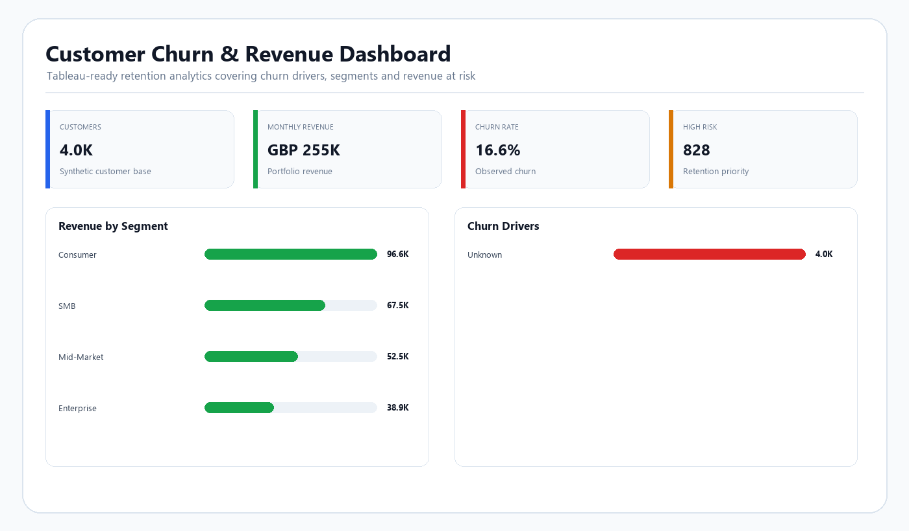

# Customer Churn & Revenue Analytics


## Demo Preview



## Business Problem

Knowing the overall churn rate is not enough.

Business leaders also need to know:

- Which segments are leaving?
- Which behaviours are associated with churn?
- How much revenue is exposed?
- Which active customers deserve immediate retention attention?
- Which commercial or service issues are driving risk?

This project turns customer-level data into executive and retention-focused analytics.

## Tech Stack

- Python
- Pandas
- SQL
- Tableau-ready dataset
- Tableau calculated-field design
- Customer / revenue analytics

## Repository Structure

```text
customer-churn-revenue-analytics/
├── data/
│   ├── raw/
│   └── processed/
├── src/
├── sql/
├── tableau/
├── docs/
├── screenshots/
├── requirements.txt
└── README.md
```

## Core KPIs

- Customer Count
- Churn Rate
- Annual Revenue
- Revenue at Risk
- P1/P2 Retention Customers
- Average Tenure
- Average NPS
- Churn by Segment
- Churn by Contract Type
- Churn by Product Tier
- Churn by Region

## Churn Drivers Analysed

- Days since last login
- Usage level
- Payment failures
- Support tickets
- NPS
- Contract type
- Product tier
- Customer tenure

## Segmentation

The dataset includes:

- Consumer
- SMB
- Mid-Market
- Enterprise

Additional dimensions include:

- region
- product tier
- sales channel
- contract type

## Risk & Retention Logic

The portfolio creates a transparent churn-risk score using behavioural and commercial indicators.

Customers are then prioritised using both:

**Risk**

and

**Revenue Exposure**

This prevents the retention queue from focusing only on churn probability while ignoring commercial impact.

## Tableau Dashboard Design

### Executive Churn Overview
Churn, revenue, segment and risk KPIs.

### Churn Drivers
Behavioural and commercial factors associated with churn.

### Retention Opportunity
High-value / high-risk customer prioritisation.

See [`tableau/dashboard_spec.md`](tableau/dashboard_spec.md).

## Executive Business Case

See [`docs/executive_business_case.md`](docs/executive_business_case.md) for a practical action model linking analytics to:

- billing recovery
- engagement campaigns
- service recovery
- retention offers
- intervention measurement

## SQL Analysis

The project includes queries for:

- churn by segment
- churn by contract
- revenue at risk
- retention queue
- activity/inactivity analysis
- NPS and churn

## Run Data Preparation

```bash
pip install -r requirements.txt
python src/prepare_data.py
```

## Skills Demonstrated

- Tableau
- SQL
- Python
- Customer analytics
- Business intelligence
- Segmentation
- Revenue analytics
- Churn analysis
- Data preparation
- Executive reporting
- Commercial prioritisation
- Stakeholder storytelling

## Interview Talking Points

1. Churn rate vs retention rate.
2. Churn drivers vs causal drivers.
3. Revenue at risk.
4. Customer segmentation.
5. Contract and pricing effects.
6. NPS interpretation.
7. Retention intervention measurement.
8. Customer lifetime value.
9. How to validate a predictive model.
10. How to operationalise analytics with CRM data.

## Portfolio Classification

**Type:** Portfolio Build  
**Data:** Synthetic  
**Purpose:** Demonstrate Tableau, SQL, Python and commercially focused customer analytics.
